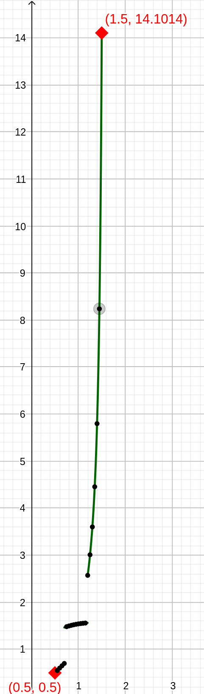

МИНИСТЕРСТВО НАУКИ  И ВЫСШЕГО ОБРАЗОВАНИЯ РОССИЙСКОЙ ФЕДЕРАЦИИ  
Федеральное государственное автономное образовательное учреждение высшего образования  
"КРЫМСКИЙ ФЕДЕРАЛЬНЫЙ УНИВЕРСИТЕТ им. В. И. ВЕРНАДСКОГО"  
ФИЗИКО-ТЕХНИЧЕСКИЙ ИНСТИТУТ  
Кафедра компьютерной инженерии и моделирования
<br/><br/>
### Отчёт по лабораторной работе № 2<br/> по дисциплине "Программирование"
<br/>
​
студента 1 курса группы 191(2)  
<br/>Лисовского Владимира Сергеевича  
<br/>направления подготовки 09.03.01 "Информатика и вычислительная техника" 

<br/><br/>
<table>
<tr><td>Научный руководитель<br/> старший преподаватель кафедры<br/> компьютерной инженерии и моделирования</td>
<td>(оценка)</td>
<td>Чабанов В.В.</td>
</tr>
</table>
<br/><br/>
​
Симферополь, 2019

####Цель
* Овладеть практическими навыками разработки и программирования вычислительного процесса циклической структуры;
* Сформировать навыков программирования алгоритмов разветвляющейся структуры;
* Изучить операторы ветвления. Особенности использования полной и сокращенной формы оператора `if` и тернарного оператора.
#### Ход работы
Из таблицы была выбрана фукция 4.

1. Протабулируйте функцию и запишите получившиеся реультаты в отчёт в виде таблицы. При этом ***a*** = 0.7, ***b*** = 1.2, начала и конца интервала ***х<sub>нач</sub>*** = 0.5, ***x<sub>кон</sub>*** = 1.5 и шага ***d<sub>x</sub>*** = 0.05;

    | x | y |
    |---|---|
    |  0.5 | 0.5 |
    |  0.55 | 0.55 |
    |  0.6 | 0.6 |
    |  0.65 | 0.65 |
    |  0.7 | 0.7 |
    |  0.75 | 1.48169 |
    |  0.8 | 1.49671 |
    |  0.85 | 1.50998 |
    |  0.9 | 1.52161 |
    |  0.95 | 1.53168 |
    |  1 | 1.5403 |
    |  1.05 | 1.54757 |
    |  1.1 | 1.5536 |
    |  1.15 | 1.55849 |
    |  1.2 | 2.57215 |
    |  1.25 | 3.00957 |
    |  1.3 | 3.6021 |
    |  1.35 | 4.45522 |
    |  1.4 | 5.79788 |
    |  1.45 | 8.23809 |
    |  1.5 | 14.1014 |

2. Определите минимальное и максимальное значение функции на указанном интервале и запешите результаты в отчёт;

    Минимум: 14.1014,  максимум: 0.5.
    
3. График функции 4 с нанесенными точками, которые получились в процессе табуляции, и точками минимума и максимума (рис. 1).

     (рис. 1)

#### Код программы
```cpp
#include <iostream>
#include <cmath>

using namespace std;

double z1(double x){
    return (abs(x));
}

double z2(double x){
    return (abs(x)) + cos(x);
}

double z3(double x){
    return (tan(x));
}


int main(){
    double a, b ,x1, x2, d, temp, x_max, x_min, x;

    bool flag = true;

    x_max = 0;
    x_min = 0;

    cin >> a >> b >> x1 >> x2 >> d;

    cout << "|  " << 'x' << " | " << 'y' << " |" <<  endl << "|-----|-----|" << endl;

    for (int i = 0; i <= (x2 -x1)/d; i ++){
        x = x1 + (d*i);
        if (x <= a) {
            temp = z1(x);
            if (flag) {
                x_max = temp;
                x_min = temp;
                flag = false;
            }
        }
        else if ((a < x)&& (x < b)) {
            temp = z2(x);
            if (flag) {
                x_max = temp;
                x_min = temp;
                flag = false;
            }
        }
        else if( x >= b){
            temp = z3(x);
            if (flag) {
                x_max = temp;
                x_min = temp;
                flag = false;
            }
        }

        if (temp > x_max) x_max = temp;
        if (temp < x_min) x_min = temp;

        cout <<  "|  " << x << " | " << temp<< " |" <<  endl;
    }
    cout << endl << "max: " << x_max << "  min: " << x_min << endl;
    return 0;
}
```

#### Ввывод
в ходе лабораторной работы были получены такие навыки, как
* умение применять оператор ветвления и циклы;
* разработка и программирование вычислительного процесса циклической структуры;
* программирование алгоритмов разветвляющейся структуры.

