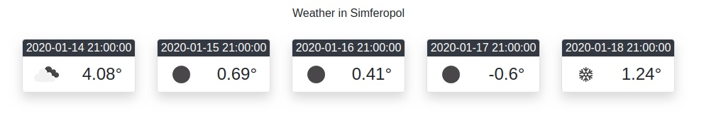

МИНИСТЕРСТВО НАУКИ  И ВЫСШЕГО ОБРАЗОВАНИЯ РОССИЙСКОЙ ФЕДЕРАЦИИ  
Федеральное государственное автономное образовательное учреждение высшего образования  
"КРЫМСКИЙ ФЕДЕРАЛЬНЫЙ УНИВЕРСИТЕТ им. В. И. ВЕРНАДСКОГО"  
ФИЗИКО-ТЕХНИЧЕСКИЙ ИНСТИТУТ  
Кафедра компьютерной инженерии и моделирования
<br/><br/>
### Отчёт по лабораторной работе № 6<br/> по дисциплине "Программирование"
<br/>
​
студента 1 курса группы 191(2)  
<br/>Лисовского Владимира Сергеевича  
<br/>направления подготовки 09.03.01 "Информатика и вычислительная техника" 

<br/><br/>
<table>
<tr><td>Научный руководитель<br/> старший преподаватель кафедры<br/> компьютерной инженерии и моделирования</td>
<td>(оценка)</td>
<td>Чабанов В.В.</td>
</tr>
</table>
<br/><br/>
​
Симферополь, 2019

#### Цель

* Закрепить навыки разработки многофайловыx приложений;
* Изучить способы работы с API web-сервиса;
* Изучить процесс сериализации/десериализации данных.

#### Ход работы

1. Программный код
    ```cpp
   #include <iostream>
   #include <string>
   #include <fstream>
   
   #include "json.hpp"
   #include "httplib.h"
   
   using json = nlohmann::json;
   
   void
   replace(std::string& str, const std::string& from, const std::string& to)
   {
       size_t start_pos = str.find(from);
       if(start_pos == std::string::npos) {
           return;
       }
       str.replace(start_pos, from.length(), to);
   }
   
   void
   gen_response(const httplib::Request& req, httplib::Response& res)
   {
       std::string s;
       httplib::Client cli("api.openweathermap.org", 80);
       auto result = cli.Get("/data/2.5/forecast?id=693805&APPID=f22a30a0bd02eeadff2e3c5132442df2&units=metric");
       json j = json::parse(result->body);
       std::cout << j.at("city").at("name") << std::endl;
       int start = j.at("list")[0].at("dt");
   
       std::ifstream ifs("Weather.html");
       getline(ifs, s, '\0');
       ifs.close();
       replace(s, "{city.name}", j.at("city").at("name"));
       for (auto& el : j.at("list").items())
       {
           if (el.value().at("dt") >= start)
           {
               replace(s, "{list.dt}", el.value().at("dt_txt"));
               replace(s, "{list.weather.icon}", el.value().at("weather")[0].at("icon"));
               replace(s, "{list.main.temp}", to_string(el.value().at("main").at("temp")));
               start += 86400;
           }
       }
       res.set_content(s, "text/html");
   }
   
   int
   main()
   {
       std::cout << "SERVER RUN!" << std::endl;
       httplib::Server svr;
       svr.Get("/", gen_response);
       svr.listen("localhost", 3000);
   }
    ```
2. API KEY f22a30a0bd02eeadff2e3c5132442df2
3. Скриншот
    
   
#### Ввывод

в ходе лабораторной работы были получены такие навыки, как
* работа с многофайловыми проектами;
* работа с API запросами;
* работа с JSON;
* чтение/запись файлов.

