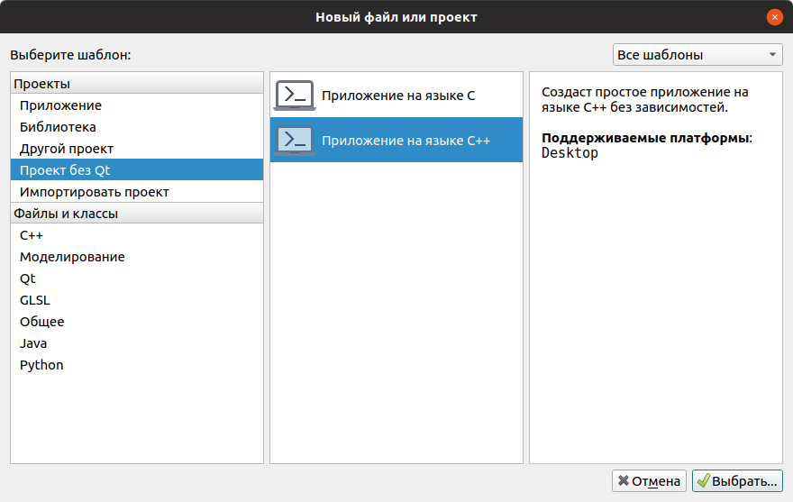
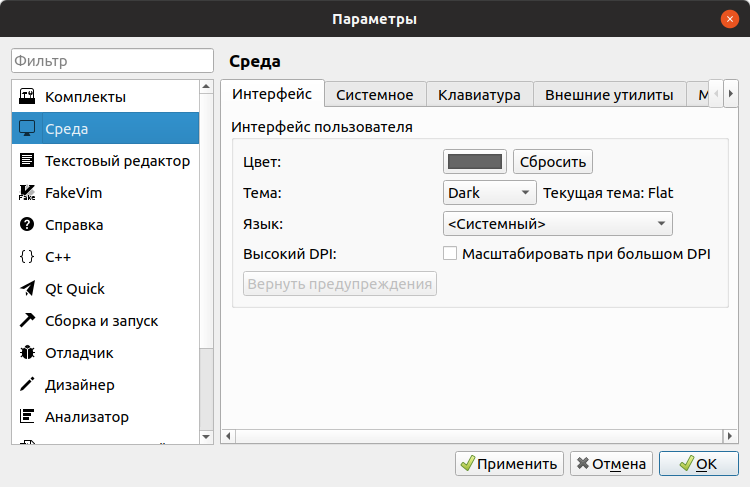
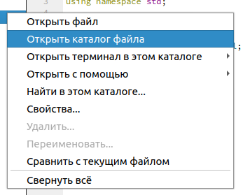
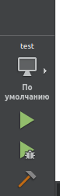
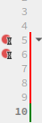
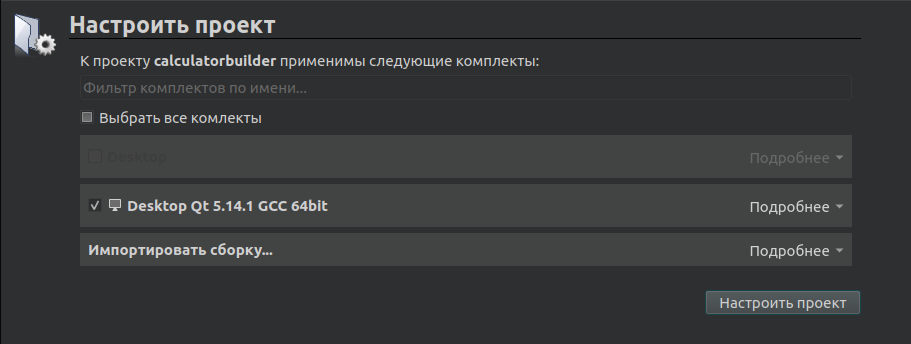
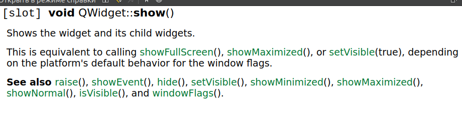
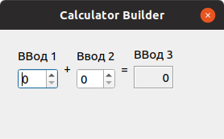

МИНИСТЕРСТВО НАУКИ  И ВЫСШЕГО ОБРАЗОВАНИЯ РОССИЙСКОЙ ФЕДЕРАЦИИ 
Федеральное государственное автономное образовательное учреждение высшего образования   
"КРЫМСКИЙ ФЕДЕРАЛЬНЫЙ УНИВЕРСИТЕТ им. В. И. ВЕРНАДСКОГО"   
ФИЗИКО-ТЕХНИЧЕСКИЙ ИНСТИТУТ   
Кафедра компьютерной инженерии и моделирования
   

<h3>

Отчёт по лабораторной работе № 7  по дисциплине "Программирование"

</h3> 
  
студента 1 курса группы "ИВТ-б-о-191(2)"  
 Лисовского Владимира Сергеевича  
 направления подготовки 09.03.01 "Информатика и вычислительная техника" 
   
<table>
<tr><td>Научный руководитель  старший преподаватель кафедры  компьютерной инженерии и моделирования</td>
<td>(оценка)</td>
<td>Чабанов В.В.</td>
</tr>
</table>
  

Симферополь, 2020

---

#### Цель

* изучить основные возможности создания и отладки программ в IDE Qt Creator.

---

#### Ход работы
1. **Как создать консольное приложение С++ в IDE Qt Creator без использования компонентов Qt?**

    * Нужно открыть `Файл` меню и выбрать `Создать файл или проект`;
    * В появившемся окне выбираем `Проект без Qt`;
    * Выбираем `Приложение на языке C++` (рис. 1). 
    
    
  
             
    _(рис. 1)_   
    

2. **Как изменить цветовую схему (оформление) среды?**

    * Нужно открыть `Инструменты` меню и выбрать `Параметры`;
    * В открывшемся окне выбрать `Среда`;
    * В вкладке `Интерфейс` выбрать подходящее оформление (рис. 2).
    
    

            
    _(рис. 2)_   
    

    
3. **Как закомментировать/раскомментировать блок кода средствами Qt Creator?**
    
    * Для комментирования/раскомментирования нужно воспользоваться комбинацией `Ctrl + /`.

4. **Как открыть в проводнике папку с проектом средствами Qt Creator?**
    
    * Открыть меню проекта слева. 
    * В контекстном меню интерисующего вас файла выбрать `Открыть каталог файла` (рис. 3).
   

   
            
   _(рис. 3)_
   
   

   
5. **Какое расширение файла-проекта используется Qt Creator?**
    
    Расширение файла-проекта .pro.
    
6. **Как запустить код без отладки?**

    Для этого в левом нижнем иглу нужно выбрать кнопку `Запустить` (рис. 4)
    

    
                
   _(рис. 4)_
   
   

   
7. **Как запустить код в режиме отладки?**

    Для этого в левом нижнем иглу нужно выбрать кнопку `Запуск отладки` (рис. 4)
    
8. **Как установить/убрать точку останова (breakpoint)?**

    Нажать справа от номера соответсвующей строки. В результате установится/уберется красная точка останова (рис.5).
    

    
                   
   _(рис. 5)_
   
   

9. 
    * **Какое значение содержит переменная i в 5й строке?**
    
        Переменная i содержит значение `32767`.
        
    * **Какое значение содержит переменная d в 6й строке?**
    
        Переменная d содержит значение `0`.
        
    * **Какие значение содержатся в переменных i и  d в 7й строке?**
    
        Переменная d содержит значение `5`. Переменная i содержит значение `5`.
        
    * **Совпадают ли эти значения с теми, что вы получали в MSVS для соответствующих типов?**
    
        Да, совпадают.

10. Закройте проект и перейдите на вкладку «Начало» => «Примеры»;
11. Выберите проект «Calculator Form Example». Для этого можно воспользоваться строкой поиска;
12. Изучите (по желанию) описание проекта в открывшемся окне;
13. Сейчас вы находитесь на вкладке «Проекты». Выберите комплект сборки. На рис. 6 присутствует только один комплект, но их может быть больше, например для сборки под Android или компилятором MSVS;
    

    
                 
   _(рис. 6)_  
   
   

14. Перейдите на вкладку «Редактор» и запустите сборку проекта;
15. В инспекторе проекта выберите файл «main.cpp». В этом файле установите курсор на слово «show» в строке calculator.show(); и нажмите F1. Изучите справочную информацию. Таким же образом можно получить справку по любому объекту/методу/полю доступному в Qt;
    

    
                  
   _(рис. 7)_
   
   

   
16. В инспекторе проекта выберите файл «Формы» => «calculatorform.ui» и дважды счёлкните ЛКМ;
17. Вы попали на вкладку «Дизайн». На форме замените английский текст на русский. Пересоберите проект. (рис. 8)
    

    
                   
   _(рис. 8)_
       
   

---

#### Ввывод

в ходе лабораторной работы были получены такие навыки, как
* создавать приложения в среде Qt Creator;
* настраивать внешний вид среды;
* комментировать строки;
* запускать код в разных режимах;
* редактировать формы интерфейса.