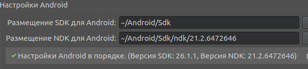
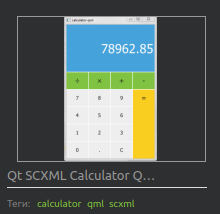

МИНИСТЕРСТВО НАУКИ  И ВЫСШЕГО ОБРАЗОВАНИЯ РОССИЙСКОЙ ФЕДЕРАЦИИ 
Федеральное государственное автономное образовательное учреждение высшего образования   
"КРЫМСКИЙ ФЕДЕРАЛЬНЫЙ УНИВЕРСИТЕТ им. В. И. ВЕРНАДСКОГО"   
ФИЗИКО-ТЕХНИЧЕСКИЙ ИНСТИТУТ   
Кафедра компьютерной инженерии и моделирования
   

<h3>

Отчёт по лабораторной работе № 8  по дисциплине "Программирование"

</h3> 
  
студента 1 курса группы "ИВТ-б-о-191(2)"  
 Лисовского Владимира Сергеевича  
 направления подготовки 09.03.01 "Информатика и вычислительная техника" 
   
<table>
<tr><td>Научный руководитель  старший преподаватель кафедры  компьютерной инженерии и моделирования</td>
<td>(оценка)</td>
<td>Чабанов В.В.</td>
</tr>
</table>
  

Симферополь, 2020

 

---

 

#### Цель

* Настроить IDE Qt Creator для разработки приложений под android ОС;
* Изучить базовые понятия связанные с мобильной разработкой;
* Научиться создавать мобильные приложения при помощи фреймворка Qt 5.14.

 

---

 

#### Ход работы

1. Указываем пусть к `JDK` в `Qt Creator`.
    
    

     
    <i>(рис. 1. Путь указан корректно)</i>
    

    
2. Указываем пусть к `SDK` и `NDK` в `Qt Creator`.

    

     
    <i>(рис. 2. Путь указан корректно)</i>
    

3. Выбираем проект для сборки.

    Был выбран проект `Qt SCXML Calculator QML Example`
    
    

     
    <i>(рис. 3. Выбор проекта)</i>
    

    
4. Собираем и запускаем проект.

        

         
        <i>(рис. 4. Приложение успешно запущено на телефоне)</i>
        

    
 

---

 

#### Ввывод

в ходе лабораторной работы были получены такие навыки, как
* умение создавать приложения под Android ОС;
* умение собирать и запускать созданные приложения на устройствах под управлением Android ОС.