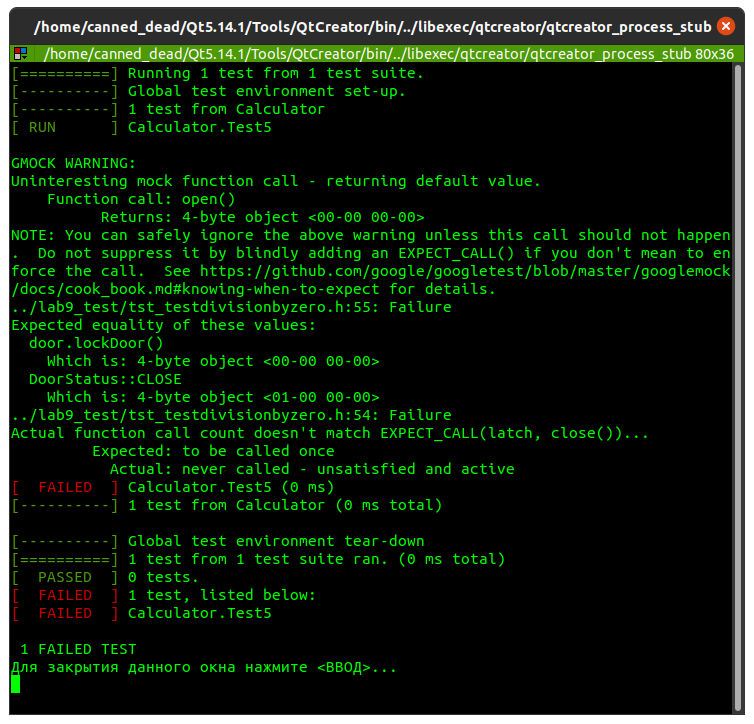
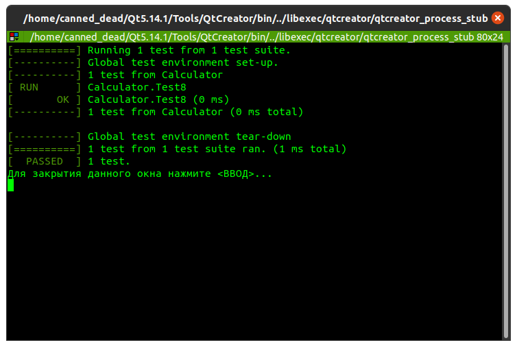
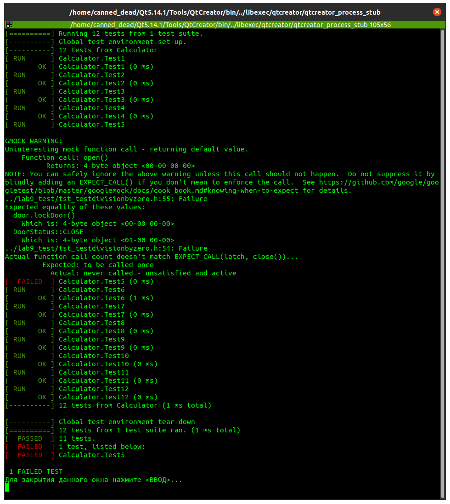

<p align="center">
МИНИСТЕРСТВО НАУКИ  И ВЫСШЕГО ОБРАЗОВАНИЯ РОССИЙСКОЙ ФЕДЕРАЦИИ<br/>
Федеральное государственное автономное образовательное учреждение высшего образования <br/> 
"КРЫМСКИЙ ФЕДЕРАЛЬНЫЙ УНИВЕРСИТЕТ им. В. И. ВЕРНАДСКОГО"  <br/>
ФИЗИКО-ТЕХНИЧЕСКИЙ ИНСТИТУТ  <br/>
Кафедра компьютерной инженерии и моделирования
<br/><br/><br/>
</p>
<h3>
<p align="center">
Отчёт по лабораторной работе № 9<br/> по дисциплине "Программирование"
</p>
</h3> 
<br/><br/>
студента 1 курса группы "ИВТ-б-о-191(2)"  
<br/>Лисовского Владимира Сергеевича  
<br/>направления подготовки 09.03.01 "Информатика и вычислительная техника" 
<br/><br/><br/>
<table>
<tr><td>Научный руководитель<br/> старший преподаватель кафедры<br/> компьютерной инженерии и моделирования</td>
<td>(оценка)</td>
<td>Чабанов В.В.</td>
</tr>
</table>
<br/><br/>
<p align="center">
Симферополь, 2020
</p>

<br/>

---

<br/>

#### Цель

* Познакомиться с Google Test и Google Mock Framework;
* Изучить базовые понятия относящийся к тестированию кода;
* Научиться тестировать классы в среде разработки Qt Creator.

<br/>

---

<br/>

#### Ход работы

**Тест 1**

Для проверки вызова метода `wait()` используем  макросы:
* `EXPECT_CALL` - проверка вызова метода;
* `Times` - количество вызвовов;
* `Exactly` - точное совпадение полученого  количества вызовов с ожидаемым.

```cpp
TEST(Calculator, Test1)
{
    MockIKeypad keypad;
    EXPECT_CALL(keypad, wait()).Times(AtLeast(1));
    MockILatch latch;
    LockController door (&keypad, &latch);
    door.wait();
}
```
_(листинг 1. Код теста 1)_

<p align="center">
<br/>
<i>(рис. 1)</i>
</p>

**Тест 2**

Для проверки вызова метода `getDoorStatus()` используем  макросы:
* `EXPECT_CALL` - проверка вызова метода;
* `Times` - количество вызвовов;
* `Exactly` - точное совпадение полученого  количества вызовов с ожидаемым.

Для проверки возвращаемого значения метода `isDoorOpen()` используем  макросы:
* `ASSERT_FALSE` - равен ли аргумент `false`;
* `WillRepeatedly` - возвращает значение при каждом вызове;
* `Return` - возвращаемое значение.

Дверь закрыта. Значит класс `ILatch` должен вернуть `DoorStatus::CLOSE` при вызове метода `getDoorStatus`.
    
```cpp
TEST(Calculator, Test2)
{
    MockIKeypad keypad;
    MockILatch latch;
    LockController door (&keypad, &latch);
    EXPECT_CALL(latch, getDoorStatus()).Times(Exactly(1)).WillRepeatedly(Return(DoorStatus::CLOSE));
    ASSERT_FALSE(door.isDoorOpen());
}
```
_(листинг 2. Код теста 2)_
    
<p align="center">
<br/>
<i>(рис. 2)</i>
</p>
    
**Тест 3**

Для проверки вызова метода `getDoorStatus()` используем  макросы:
* `EXPECT_CALL` - проверка вызова метода;
* `Times` - количество вызвовов;
* `Exactly` - точное совпадение полученого  количества вызовов с ожидаемым.

Для проверки возвращаемого значения метода `isDoorOpen()` используем  макросы:
* `ASSERT_TRUE` - равен ли аргумент `true`;
* `WillRepeatedly` - возвращает значение при каждом вызове;
* `Return` - возвращаемое значение.

Дверь открыта. Значит класс `ILatch` должен вернуть `DoorStatus::OPEN` при вызове метода `getDoorStatus`.

```cpp
TEST(Calculator, Test3)
{
    MockIKeypad keypad;
    MockILatch latch;
    LockController door (&keypad, &latch);
    EXPECT_CALL(latch, getDoorStatus()).Times(Exactly(1)).WillRepeatedly(Return(DoorStatus::OPEN));
    ASSERT_TRUE(door.isDoorOpen());
}
```
_(листинг 3. Код теста 3)_

<p align="center">
<br/>
<i>(рис. 3)</i>
</p>

**Тест 4**

Для проверки вызова метода `open()` используем  макросы:
* `EXPECT_CALL` - проверка вызова метода;
* `Times` - количество вызвовов;
* `Exactly` - точное совпадение полученого  количества вызовов с ожидаемым.

Для проверки возвращаемого значения метода `unlockDoor()` используем  макросы:
* `ASSERT_EQ` - равны ли аргументы;
* `WillRepeatedly` - возвращает значение при каждом вызове;
* `Return` - возвращаемое значение.

Защелка двери успешно открывается. Значит класс `ILatch` должен вернуть `DoorStatus::OPEN` при вызове метода `open`.

```cpp
TEST(Calculator, Test4)
{
    MockIKeypad keypad;
    MockILatch latch;
    LockController door (&keypad, &latch);
    EXPECT_CALL(latch, open()).Times(Exactly(1)).WillRepeatedly(Return(DoorStatus::OPEN));
    ASSERT_EQ(door.unlockDoor(), DoorStatus::OPEN);
}
```
_(листинг 4. Код теста 4)_

<p align="center">
<br/>
<i>(рис. 4)</i>
</p>

**Тест 5**

Для проверки вызова метода `close()` используем  макросы:
* `EXPECT_CALL` - проверка вызова метода;
* `Times` - количество вызвовов;
* `Exactly` - точное совпадение полученого  количества вызовов с ожидаемым.

Для проверки возвращаемого значения метода `lockDoor()` используем  макросы:
* `ASSERT_EQ` - равны ли аргументы;
* `WillRepeatedly` - возвращает значение при каждом вызове;
* `Return` - возвращаемое значение.

Защелка двери успешно закрывается. Значит класс `ILatch` должен вернуть `DoorStatus::CLOSE` при вызове метода `open`.

```cpp
TEST(Calculator, Test5)
{
    MockIKeypad keypad;
    MockILatch latch;
    LockController door (&keypad, &latch);
    EXPECT_CALL(latch, close()).Times(Exactly(1)).WillRepeatedly(Return(DoorStatus::CLOSE));
    ASSERT_EQ(door.lockDoor(), DoorStatus::CLOSE);
}
```
_(листинг 5а. Код теста 5)_

<p align="center">
<br/>
<i>(рис. 5)</i>
</p>

Из рис.5 видно, что метод `lockDoor` не вернул ожидаемое `DoorStatus::CLOSE` потому что метод `close` не был вызван.
Рассмотрим программный код метода `lockDoor`. Видно, что в теле метода вызовается метод `open` класса `ILatch`. 
Иными словами, мы открываем дверь, когда от нас ожидают ее закрытия. Исправить ошибку можно заменой вызова метода `open` 
на вызов метода `close`.

```cpp
DoorStatus LockController::lockDoor()
{
    return latch->open();
}
```
_(листинг 5б. Код c ошибкой)_

```cpp
DoorStatus LockController::lockDoor()
{
    return latch->close();
}
```
_(листинг 5в. Код без ошибки)_

На мой взгляд, такая ошибка может возникнуть при копировании тел довольно схожих методов.


**Тест 6**

Для проверки вызова метода `isActive()` используем  макросы:
* `EXPECT_CALL` - проверка вызова метода;
* `Times` - количество вызвовов;
* `Exactly` - точное совпадение полученого  количества вызовов с ожидаемым.

Для проверки возвращаемого значения метода `hardWareCheck()` используем  макросы:
* `ASSERT_EQ` - равны ли аргументы;
* `WillRepeatedly` - возвращает значение при каждом вызове;
* `Return` - возвращаемое значение.

С оборудллванем все в порядке. Значит методы `isActive` классов `IKeypad` и `ILatch` должны вернуть `true`.

```cpp
TEST(Calculator, Test6)
{
    MockIKeypad keypad;
    MockILatch latch;
    LockController door (&keypad, &latch);
    EXPECT_CALL(keypad, isActive()).Times(Exactly(1)).WillRepeatedly(Return(true));
    EXPECT_CALL(latch, isActive()).Times(Exactly(1)).WillRepeatedly(Return(true));
    ASSERT_EQ(door.hardWareCheck(), HardWareStatus::OK);
}
```
_(листинг 6. Код теста 6)_

<p align="center">
<br/>
<i>(рис. 6)</i>
</p>

**Тест 7**

Для проверки вызова метода `isActive()` используем  макросы:
* `EXPECT_CALL` - проверка вызова метода;
* `Times` - количество вызвовов;
* `AnyNumber` - любое число вызовов.

Для проверки возвращаемого значения метода `hardWareCheck()` используем  макросы:
* `ASSERT_EQ` - равны ли аргументы;
* `WillRepeatedly` - возвращает значение при каждом вызове;
* `Return` - возвращаемое значение.

С задвижкой все в порядке. Значит метод `isActive` класса `ILatch` должен вернуть `true`.

```cpp
TEST(Calculator, Test7)
{
    MockILatch latch;
    MockIKeypad keypad;
    LockController door (nullptr, &latch);
    EXPECT_CALL(keypad, isActive()).Times(AnyNumber());
    EXPECT_CALL(latch, isActive()).Times(AnyNumber()).WillRepeatedly(Return(true));
    ASSERT_EQ(door.hardWareCheck(), HardWareStatus::ERROR);
}
```
_(листинг 7. Код теста 7)_

<p align="center">
<br/>
<i>(рис. 7)</i>
</p>

**Тест 8**

Для проверки вызова метода `isActive()` используем  макросы:
* `EXPECT_CALL` - проверка вызова метода;
* `Times` - количество вызвовов;
* `AnyNumber` - любое число вызовов.

Для проверки возвращаемого значения метода `hardWareCheck()` используем  макросы:
* `ASSERT_EQ` - равны ли аргументы;
* `WillRepeatedly` - возвращает значение при каждом вызове;
* `Return` - возвращаемое значение.

Задвижка не активна. Значит метод `isActive` класса `ILatch` должен вернуть `false`.
С клавиатурой все в порядке. Значит метод `isActive` класса `IKeypad` должен вернуть `true`.

```cpp
TEST(Calculator, Test8)
{
    MockIKeypad keypad;
    MockILatch latch;
    LockController door (&keypad, &latch);
    EXPECT_CALL(keypad, isActive()).Times(AnyNumber()).WillRepeatedly(Return(true));
    EXPECT_CALL(latch, isActive()).Times(AnyNumber()).WillRepeatedly(Return(false));
    ASSERT_EQ(door.hardWareCheck(), HardWareStatus::ERROR);
}
```
_(листинг 8. Код теста 8)_

<p align="center">
<br/>
<i>(рис. 8)</i>
</p>

**Тест 9**

Для проверки вызова метода `requestPassword()` используем  макросы:
* `EXPECT_CALL` - проверка вызова метода;
* `Times` - количество вызвовов;
* `Exactly` - точное совпадение полученого  количества вызовов с ожидаемым.

Для проверки возвращаемого значения метода `isCorrectPassword()` используем  макросы:
* `ASSERT_TRUE` - равен ли аргумент `true`;
* `WillRepeatedly` - возвращает значение при каждом вызове;
* `Return` - возвращаемое значение.

Следуем тексту задания и комментариям в программном коде. После вызова конструктора поле `password` класса `LockController`
имеет значение `0000`. Для ввода пароля используется метод `isCorrectPassword`, который запрашивает пароль у класса `IKeypad`.
Значит метод `requestPassword` класса `IKeypad` должен вернуть `PasswordResponse{PasswordResponse::Status::OK, "0000"}`.

```cpp
TEST(Calculator, Test9)
{
    MockIKeypad keypad;
    MockILatch latch;
    LockController door (&keypad, &latch);
    EXPECT_CALL(keypad, requestPassword()).Times(Exactly(1)).WillRepeatedly(Return(PasswordResponse{PasswordResponse::Status::OK, "0000"}));
    ASSERT_TRUE(door.isCorrectPassword());
}
```
_(листинг 9. Код теста 9)_

<p align="center">
<br/>
<i>(рис. 9)</i>
</p>

**Тест 10**

Для проверки вызова метода `requestPassword()` используем  макросы:
* `EXPECT_CALL` - проверка вызова метода;
* `Times` - количество вызвовов;
* `Exactly` - точное совпадение полученого  количества вызовов с ожидаемым.

Для проверки возвращаемого значения метода `isCorrectPassword()` используем  макросы:
* `ASSERT_FALSE` - равен ли аргумент `false`;
* `WillRepeatedly` - возвращает значение при каждом вызове;
* `Return` - возвращаемое значение.

В отличии от предыдущего теста, пользователь вводит неправильный пароль.
Значит метод `requestPassword` класса `IKeypad` должен вернуть неправильный пароль, например
 `PasswordResponse{PasswordResponse::Status::OK, "1337"}`.

```cpp
TEST(Calculator, Test10)
{
    MockIKeypad keypad;
    MockILatch latch;
    LockController door (&keypad, &latch);
    EXPECT_CALL(keypad, requestPassword()).Times(Exactly(1)).WillRepeatedly(Return(PasswordResponse{PasswordResponse::Status::OK, "1337"}));
    ASSERT_FALSE(door.isCorrectPassword());
}
```
_(листинг 10. Код теста 10)_

<p align="center">
<br/>
<i>(рис. 10)</i>
</p>

**Тест 11**

Для проверки вызова метода `requestPassword()` используем  макросы:
* `EXPECT_CALL` - проверка вызова метода;
* `Times` - количество вызвовов;
* `Exactly` - точное совпадение полученого  количества вызовов с ожидаемым.

Для проверки возвращаемого значения метода `resetPassword()` используем  макросы:
* `ASSERT_TRUE` - равен ли аргумент `true`;
* `WillRepeatedly` - возвращает значение при каждом вызове;
* `Return` - возвращаемое значение.

Для сброса пароля пользователь должен ввести старый пароль. 
Значит метод `requestPassword` класса `IKeypad` должен вернуть `PasswordResponse{PasswordResponse::Status::OK, "0000"}`.
Далее пользователь вводит новый пароль, например 1337.
Значит метод `requestPassword` класса `IKeypad` должен вернуть `PasswordResponse{PasswordResponse::Status::OK, "1337"}`.
Для проверки установленного пароля вызовем метод `isCorrectPassword` (предыдущие тесты показали, что он работает корректно),
 при этом `IKeypad` должен вернуть 
`PasswordResponse{PasswordResponse::Status::OK, "1337"}`.

```cpp
TEST(Calculator, Test11)
{
    MockIKeypad keypad;
    MockILatch latch;
    LockController door (&keypad, &latch);
    EXPECT_CALL(keypad, requestPassword()).Times(Exactly(3))
            .WillOnce(Return(PasswordResponse{PasswordResponse::Status::OK, "0000"}))
            .WillRepeatedly(Return(PasswordResponse{PasswordResponse::Status::OK, "1337"}));
    door.resetPassword();
    ASSERT_TRUE(door.isCorrectPassword());
}
```
_(листинг 11. Код теста 11)_

<p align="center">
<br/>
<i>(рис. 11)</i>
</p>

**Тест 12**

Для проверки вызова метода `requestPassword()` используем  макросы:
* `EXPECT_CALL` - проверка вызова метода;
* `Times` - количество вызвовов;
* `Exactly` - точное совпадение полученого  количества вызовов с ожидаемым.

Для проверки возвращаемого значения метода `resetPassword()` используем  макросы:
* `ASSERT_TRUE` - равен ли аргумент `true`;
* `WillRepeatedly` - возвращает значение при каждом вызове;
* `Return` - возвращаемое значение.

Устанавливаем пароль `9876` вызовом метода `resetPassword` и вводом старого пароля `0000` и нового пароля `9876`.
Далее действия аналогичны предыдущему тесту.

```cpp
TEST(Calculator, Test12)
{
    MockIKeypad keypad;
    MockILatch latch;
    LockController door (&keypad, &latch);
    EXPECT_CALL(keypad, requestPassword()).Times(Exactly(5))
            .WillOnce(Return(PasswordResponse{PasswordResponse::Status::OK, "0000"}))
            .WillOnce(Return(PasswordResponse{PasswordResponse::Status::OK, "9876"}))
            .WillOnce(Return(PasswordResponse{PasswordResponse::Status::OK, "9876"}))
            .WillRepeatedly(Return(PasswordResponse{PasswordResponse::Status::OK, "1337"}));
    door.resetPassword();  // меняем на 9876
    door.resetPassword();  // пользователь вводит пароль
    ASSERT_TRUE(door.isCorrectPassword());  // сравниваемся
}
```
_(листинг 12. Код теста 12)_

<p align="center">
<br/>
<i>(рис. 12)</i>
</p>

Результат запуска всех тестов представлен на рисунке 13.

<p align="center">
<br/>
<i>(рис. 13)</i>
</p>

<br/>

---

<br/>

#### Ввывод

в ходе лабораторной работы были получены такие навыки, как
* умение работы с Google Test;
* умение создавать MOCK-Классы.

